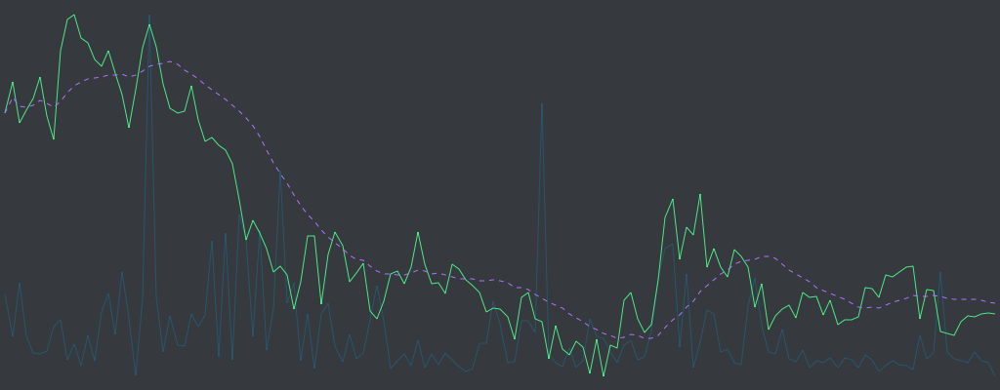

discryptord
===========
A Discord bot that will amaze your friends by emitting a *6H* chart for any magic internet currency.



## Usage
```
?price <TICKER>
```

## Install
The ancient method of invoking this minor god has long been forgotten...
So if you want to invite our evil friend into your realm, our leading scientists believe the magic cantation with the most promise goes something like:

```zsh
% go get github.com/flaymingyawn/discryptord
```

It's simple to summon our bot onces its dwelling in your proximity.
Just recite the following on a night with a new moon during the eve of planets' alignment after drawing salt circle around 3 candles with black flames:

```zsh
% go install
% go build
```

No promises, doe.

## Getting Started
First, create a bot friend on discord.
Then invite it to the channel(s) you want it to stalk...
Next, copy its **BOT_TOKEN** to your magic clipboard.

Go into this package's home directory and whisper this into your terminal:

```zsh 
% echo "BOT_TOKEN" >> .token
```

Finally, speak

```zsh
% sh start.sh
```

to start the _real_ fun.

## License
This project is under MIT License. See the [LICENSE](LICENSE) file for full license text.